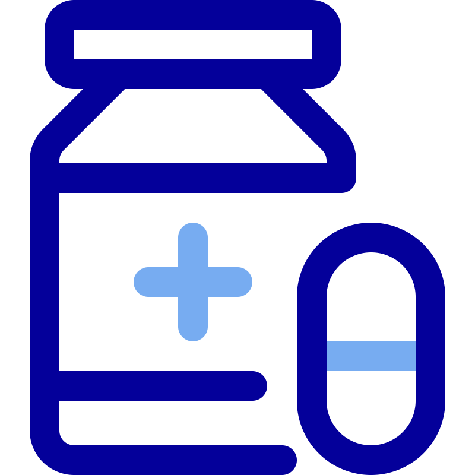
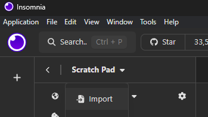
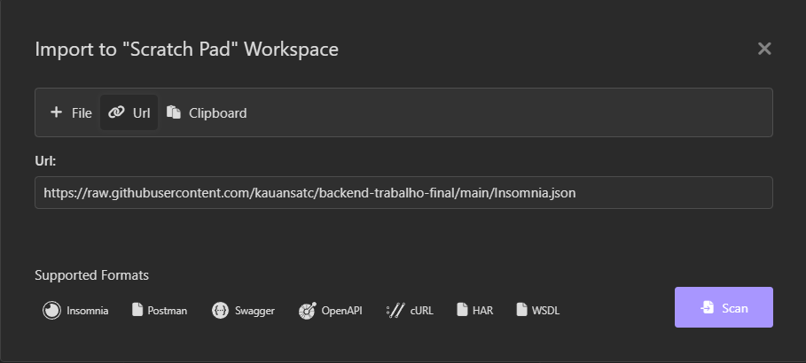

# medAPI

<div align="center" style="margin: 2rem">
	
	<div>
		API de consulta e relação de remédios e síntomas. 
	</div>
	<i style="color: royalblue">
		Equipe: Kauan Fontanela e Lucas Adriano
	</i>
</div>


## Docker
```bash
docker pull ghcr.io/kauansatc/backend-trabalho-final:latest)
```

## Insomnia
`https://raw.githubusercontent.com/kauansatc/backend-trabalho-final/main/Insomnia.json`




---


## Rotas
### `GET` /prescription
Lista de sugestões de remédios condizentes com os síntomas solicitados, acompanhado de uma avaliação equivalente à compatibilidade do remédio com os sintomas.
> Remédios com 0% de compatibilidade não são listados

#### query options
|param.|valores|descrição|	
|---|---|---|
|symptoms|`[symptom1,...]`|Lista de síntomas|

#### retorna
```jsonc
// status 200
[
	{
		"medicine": "string",
		"matchScore": 100.0, // %
		"treatsFor": [ "symptom1", "symptom2", ... ]
	},
	[...]
]

// status 400
"descrição do erro"
```


### `POST` /medicines
Cria um novo remédio.

#### body
```jsonc
[
	{
		"name": "string",
		"needsPrescription": true | false,
    		"treatsFor": [ "symptom1", "symptom2", ... ]
	},
	[...]
]
```

#### query options
|param.|valores|descrição|	
|---|---|---|
|handleNew|`true`, `false`|Em caso de tratar síntomas ainda não registrados, os registra na base de dados|

#### retorna
```jsonc
// status 200
"mensagem de sucesso"

// status 400
"descrição do erro"
```


---


### `GET` medicines

Lista dos remédios registrados.

#### query options
|param.|valores|descrição|	
|---|---|---|
|page|`>=0`|Página a ser exibida|
|size|`>0`|Número de elementos por página|


#### retorna 
```jsonc
// status 200
[
	{
		"name": "string",
		"needsPrescription": true | false,
    		"treatsFor": [ "symptom1", "symptom2", ... ]
	},
	[...]
]

// status 400
"descrição do erro"
```

---


### `PATCH` /medicines/`{nome}`
Altera as propriedades do remédio definido na rota `{nome}`.

> Todos as propriedades do request são opcionais (podem ser `null` ou simplesmente não serem inclusas no request).

> No parâmetro `treatsFor`, todos os sintomas não inclusos no request serão desassociados deste remédio, respeitando a regra de que todo remédio deve tratar ao menos 1 sintoma.


#### body
```jsonc
[
	{
		"name": "string" | null,
		"needsPrescription": true | false | null,
    		"treatsFor": [ "symptom1", "symptom2", ... ] | null
	},
	...
]
```

#### query options
|param.|valores|descrição|	
|---|---|---|
|handleNew|`true`, `false`|Em caso de tratar síntomas ainda não registrados, os registra na base de dados|

#### retorna
```jsonc
// status 200
"mensagem de sucesso"

// status 400
"descrição do erro"
```


---


### `DELETE` /medicines/`{nome}`
Apaga o remédio definido na rota `{nome}`.

#### retorna
```jsonc
// status 200
"mensagem de sucesso"

// status 400
"descrição do erro"
```


---


### `GET` symptom

Lista dos sintomas registrados.

#### query options
|param.|valores|descrição|	
|---|---|---|
|page|`>=0`|Página a ser exibida|
|size|`>0`|Número de elementos por página|
|medicine|`"name"`|Filtrar sintoma por remédios (elimina a paginação)|

#### retorna 
```jsonc
// status 200
[
	"symptom1",
	"symptom2",
	[...]
]

// status 400
"descrição do erro"
```


---


### `DELETE` /symptoms/`{nome}`
Apaga o síntoma definido na rota `{nome}`.
> Todo remédio deve tratar ao menos um síntoma, caso haja remédios que tratem exclusivamente deste síntoma, a API retornará um erro. Para contornar este erro, use o query `force=true`, que excluíra, também, os remédios exclusivamente dependentes.

#### query options
|param.|valores|descrição|	
|---|---|---|
|force|`true`,`false`|Apagar, também, remédios exclusivamentes dependentes deste síntoma|

#### retorna
```jsonc
// status 200
"mensagem de sucesso"

// status 400
"descrição do erro"
```
